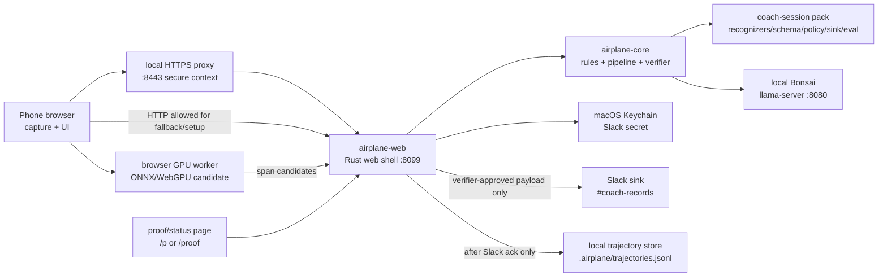
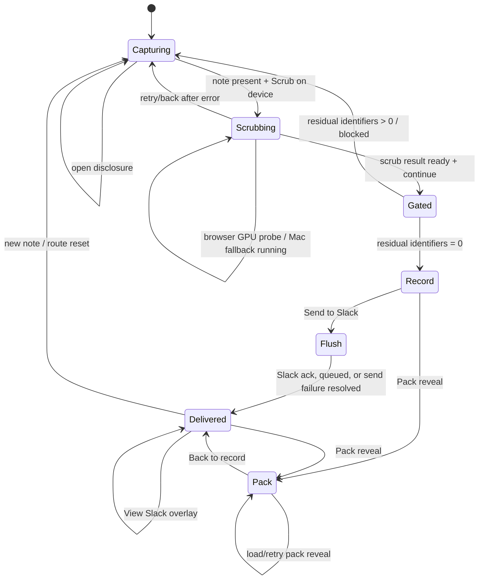

# Demo FSM And Service Map

This is the current finite-state map for the live web demo. It replaces the old
historical FSM notes archived under `docs/deprecations/canon/`.

The theme for the demo comes from Jai's intro note:
[`docs/bonsai-ecosystem-plan.md`](../bonsai-ecosystem-plan.md). The short version:
Jai is dogfooding Bonsai in public to build a real ecosystem, using a healthcare
coaching scrubber as the first honest case study for why local inference matters.

## Service Map



## Screen FSM



## State Table

| Screen | Purpose | Services touched | Sensitive data allowed | Exit rule |
| --- | --- | --- | --- | --- |
| `capturing` | Capture or paste a synthetic note; choose Browser GPU or Mac edge. | Phone browser, `airplane-web`, optional HTTPS proxy, proof/status API. | Synthetic raw note in browser; not sent until scrub. | A non-empty note enables `Scrub on device`. |
| `scrubbing` | Run recognizers, model span generation, parser/clamp, and verifier prep. | `airplane-web`, `airplane-core`, pack, local Bonsai, optional browser GPU worker. | Raw synthetic note may enter the first-party edge core. | Result must be produced or an actionable error shown. |
| `gated` | Show residual identifier count and egress decision. | `airplane-core` verifier. | Candidate clean record only. | Residual count `0` unlocks record; nonzero blocks. |
| `record` | Show the first artifact eligible for egress. | Phone browser, `airplane-web`. | Gate-clean structured record. | User can send to Slack or reveal pack. |
| `flush` | Post the clean record with local retry/idempotency behavior. | `airplane-web`, Keychain, Slack API. | Exact Slack payload must be reverified before credentials are used. | Slack `ok:true`, queued send, or failure moves to delivered status. |
| `delivered` | Show posted/queued/not-posted state and trajectory count. | Slack, local trajectory store. | Gate-clean record and PHI-free status. | Slack view overlay or pack reveal. |
| `pack` | Explain extension by pack files, not core forks. | Pack files, pack demo endpoint, verifier. | Synthetic examples only. | Back to delivered/record state. |

## Critical Guards

| Guard | Applies to | Why |
| --- | --- | --- |
| Secure context required for phone Browser GPU | `capturing -> scrubbing` | WebGPU on phone requires HTTPS; use local `:8443`, not a public tunnel for scrub traffic. |
| No full render during dictation | `capturing` | Prevents mobile speech recognition and keyboard focus from destabilizing the screen. |
| Model output is never trusted raw | `scrubbing` | Bonsai output must be stripped, parsed, schema-shaped, clamped, and verified. |
| Residual identifiers must be zero | `gated`, `record`, `flush` | Default-deny egress. |
| Slack ack precedes trajectory append | `flush -> delivered` | The trajectory store records only successful gate-clean outbound actions. |
| Pack cannot execute code | `pack` | Packs adapt workflow vocabulary without changing the trust boundary. |

## Addressable State

The web shell uses query-string routing for shareable demo state:

```text
/?step=gated
/?step=record
/?step=delivered
/?step=pack
```

Result-dependent screens fall back to `capturing` when no scrub result exists.
This keeps links safe for demos and prevents impossible UI states.

## Service Failure Meanings

| Observed UI state | Meaning | Likely fix |
| --- | --- | --- |
| Browser GPU requires HTTPS | Phone opened LAN HTTP; WebGPU is not exposed. | Open `https://<mac-lan-ip>:8443/` and trust the local CA if needed. |
| Model off | `llama-server` is not reachable on `127.0.0.1:8080`. | Run `./scripts/serve-model.sh`. |
| Slack preview | Slack credentials are absent. | Configure `SLACK_WEBHOOK_URL` or bot token. |
| Not posted / phone lost edge | Phone did not complete `/api/send` to the laptop edge. | Reconnect to same Wi-Fi/hotspot and let outbox replay. |
| Gate blocked | Verifier found residual identifiers in the outbound payload. | Fix recognizers/policy/model output; do not bypass the gate. |
