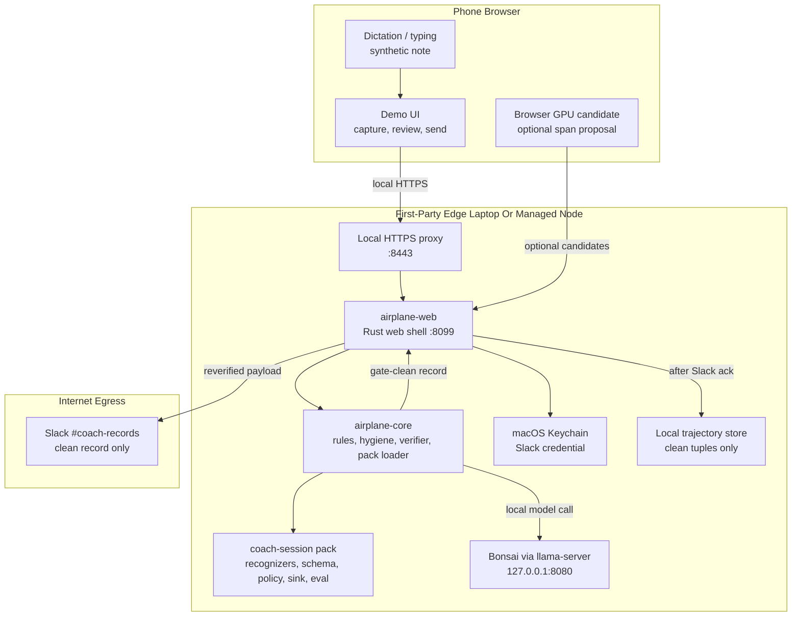
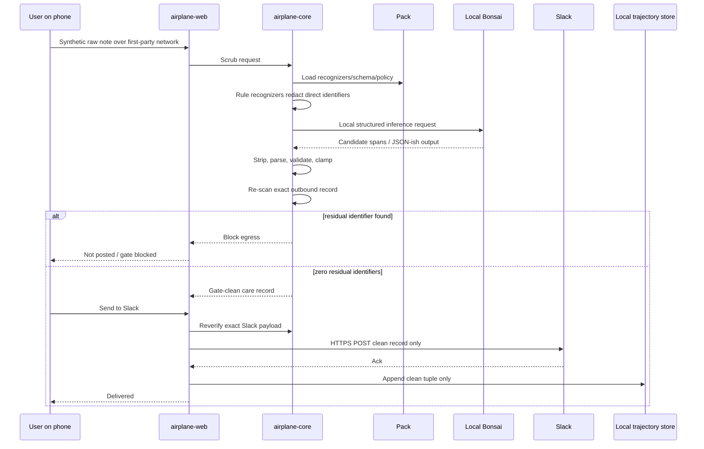

# Stack And Adoption Proof

This document benchmarks the current repo against its own source material and
explains why the stack is shaped this way. It is written for someone deciding
whether the template is understandable, reproducible, and adoptable.

## The Promise

Airplane Mode proves this pattern:

```text
capture a synthetic sensitive note
-> scrub it on a first-party edge node
-> verify the exact outbound payload
-> send only a clean record to Slack
```

Allowed claim:

> Raw synthetic notes stay on the first-party phone/laptop edge, and only a
> verifier-clean record reaches Slack.

Disallowed claim:

> Raw notes never leave the phone.

The current demo is a first-party edge proof, not the final phone-local
airplane-mode proof. That honesty is part of the adoption story.

## Source Benchmark

| Source | What it requires | Current repo evidence | Status |
| --- | --- | --- | --- |
| `docs/bonsai-ecosystem-plan.md` | Dogfood Bonsai in public; make a real healthcare coaching case study; name limits. | README, demo docs, eval, and intro all frame this as a Bonsai ecosystem reference with the laptop-edge limit explicit. | Met |
| `CANON.md` | One current path: phone browser -> first-party edge laptop -> verifier gate -> Slack. | `README.md`, `docs/demo/onboarding.md`, `docs/demo/fsm-service-map.md`, and `docs/demo/system-network-data-flows.md`. | Met |
| `files/adr-014-portable-rust-core.md` | Thin Rust core owns rules, pipeline, pack loading, hygiene, verifier; model/platforms are ports. | `crates/airplane-core/`, `shells/web/`, `shells/cli/`, `shells/mcp/`, `shells/ios/`. | Met |
| `files/adr-015-airplane-mode-simulated-in-web-demo.md` | Web demo must not claim literal radio-off proof; laptop is current edge node. | README and CANON say phone is capture, laptop is compute, native proof deferred. | Met |
| `docs/sovereign-network-pattern.md` | No public tunnel for raw notes; use same Wi-Fi, hotspot, LAN, or IT-managed VPN. | `./run.sh web`, `./run.sh https-proxy`, local `:8443` phone path, Cloudflare boundary doc. | Met |
| `docs/demo/fsm-service-map.md` | Screens map to services and guards; impossible states fall back safely. | Addressable states are documented; sensitive data is allowed only in capture/scrub boundaries. | Met |
| `docs/demo/reference-architecture.md` | Adopters change packs, not the core; builders extend ports, not the trust rule. | `packs/coach-session/`, `docs/extending.md`, pack-blindness gates. | Met |
| `eval/golden-run.txt` | The reference pack must substantiate recall/leakage claims. | 21 notes, 5 seeded passes, 100% recall, 0 leakage, 100% hard-case recall. | Met for synthetic demo |
| `docs/deprecations/decision-records/DR-2026-06-26-public-context-graph.md` | Keep raw spikes and internal sausage out of the public starter graph. | `./run.sh public-graph` blocks tracked spike/log/local artifacts. | Met |

## Why This Stack

| Choice | Why we chose it | What it avoids |
| --- | --- | --- |
| Rust core | The verifier gate and pack executor are trust-path logic. Rust keeps the reviewed core small, portable, and owned. | Duplicating recall-critical logic per runtime. |
| Ports and adapters | Inference, capture, storage, and sinks vary by runtime. The core depends on traits, not platforms. | Locking the architecture to iOS, Slack, or one model server. |
| Bonsai via `llama-server` | Gives a local OpenAI-compatible model endpoint today, with pinned model setup and reproducible eval. | Cloud LLMs seeing raw notes. |
| Browser phone shell | Works today with no TestFlight and lets the phone be the capture surface for live demos. | Waiting on native distribution before proving the workflow. |
| Local HTTPS proxy | Gives phone browsers the secure context needed for dictation/WebGPU behavior without a public tunnel. | Routing raw notes through third-party transport. |
| Slack sink | Makes egress visible and familiar: the audience can see the clean record arrive. | Abstract success that no one can inspect. |
| Declarative pack | Lets adopters change identifiers, schema, policy, sink, and evals without touching trust code. | Fork-per-clinic or unsafe executable plugins. |
| Golden eval + gates | Turns the privacy promise into a repeatable check. | Marketing claims without reproduction evidence. |
| GitOps deprecations | Keeps old ideas recoverable without making them part of the starter path. | Losing useful experiments or overwhelming new users. |

## Where Each Part Runs



## Critical Data Flow



## How We Deliver The Promise

1. **Synthetic-only input.** The demo and eval set are synthetic. This is a
   starter template, not a production medical deployment.
2. **First-party network.** The phone reaches the laptop or managed edge over
   same Wi-Fi, hotspot, LAN, local HTTPS, or IT-managed VPN.
3. **Local inference.** Bonsai runs through local `llama-server`; browser GPU is
   the next phone-local path but not required for the current proof.
4. **Model output is untrusted.** The core strips, parses, schema-validates,
   clamps, and re-scans model output before egress.
5. **Default-deny gate.** Slack and trajectory storage both sit behind the
   verifier. No clean proof, no send.
6. **Egress is reverified.** `/api/send` re-checks the exact Slack payload before
   credentials are used.
7. **Slack ack gates trajectory storage.** The trajectory store appends only
   after Slack accepts the verifier-clean record.
8. **Pack extension is bounded.** Adopters change files under a pack; they do
   not fork or weaken the core verifier.
9. **Regression proof exists.** `./run.sh gates-fast` checks structural and
   policy gates. `./run.sh gates` adds recall/leakage model proof.
10. **Sausage is not the starter graph.** `./run.sh public-graph` fails if raw
    spikes, logs, model weights, local certs, or private audit docs become
    tracked.

## Adoption Walkthrough

An adopter can reproduce the use case with this sequence:

```bash
./scripts/serve-model.sh
./run.sh web
./run.sh https-proxy
```

Then open:

```text
https://<mac-lan-ip>:8443
```

To verify the trust boundary:

```bash
./run.sh public-graph
./run.sh gates-fast
./run.sh gates
AIRPLANE_WEB_URL=http://127.0.0.1:8099 ./run.sh slack-smoke
```

To adopt it for a new workflow:

```bash
cp -r packs/coach-session packs/my-workflow
PACK=packs/my-workflow ./run.sh eval
PACK=packs/my-workflow ./run.sh gates
```

The adoption unit is the pack. The trusted core stays the same.

## What Is Not Proven Yet

| Non-claim | Why it matters | Path to prove it |
| --- | --- | --- |
| Real iPhone-local Bonsai text inference | Current reliable compute runs on the laptop edge. | Browser GPU or MLX device measurement. |
| Literal radio-off airplane-mode proof | The web demo needs network access to reach the laptop edge. | Native/on-device shell with measured local inference. |
| HIPAA compliance | Compliance requires organization scope, controls, and contracts. | Treat this as a synthetic reference architecture; production needs legal/security review. |
| Production encrypted trajectory storage | Current local trajectory store is gate-clean but not enclave-backed. | Implement `SecureStore` for the deployment target. |

These are not weaknesses to hide. They are claim boundaries that make adoption
safer and builder contribution more precise.
