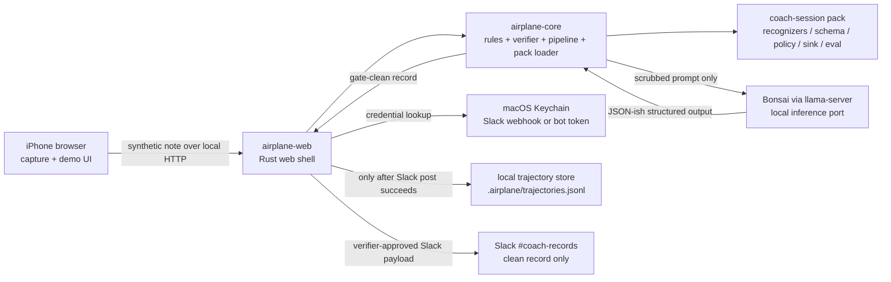
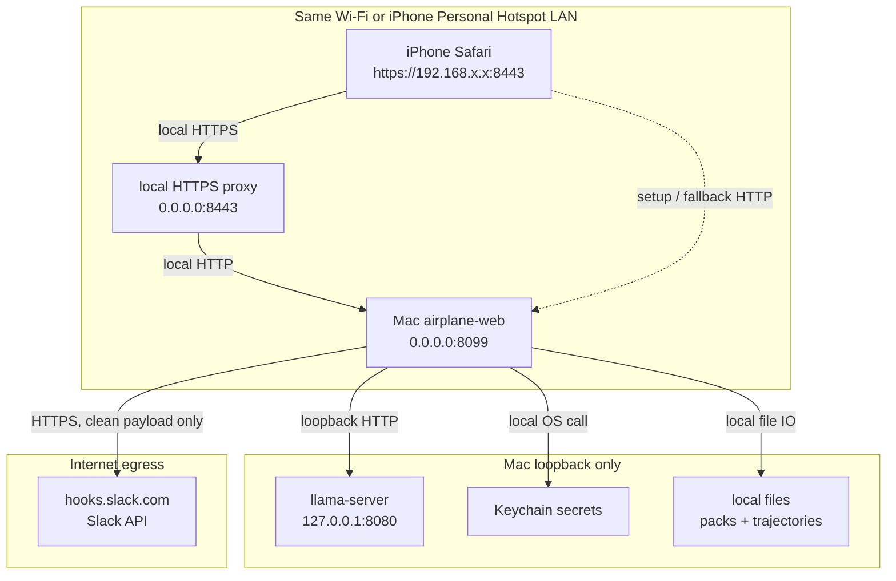
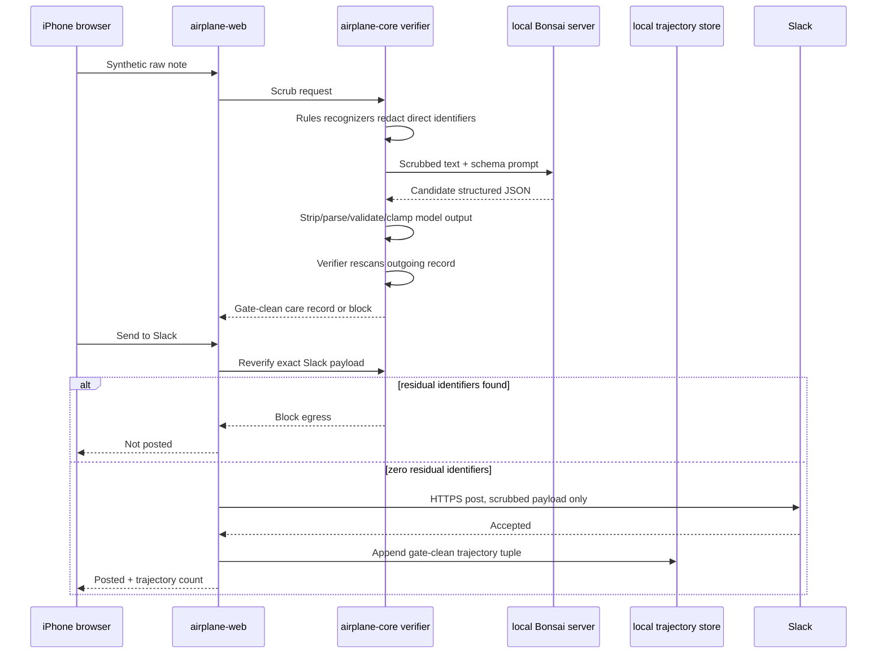

# System, Network, and Data Flows

This is the review map for the phone demo. Use `https://<mac-lan-ip>:8443` when
testing Browser GPU on a phone, because WebGPU needs a secure context. The
plain `http://<mac-lan-ip>:8099` route remains useful for laptop setup and
fallback checks.

For the screen FSM that sits on top of this service map, see
[`fsm-service-map.md`](fsm-service-map.md). For the narrative anchor behind the
demo, see [`../bonsai-ecosystem-plan.md`](../bonsai-ecosystem-plan.md).

## 1. System Architecture



Key boundary: `airplane-core` owns rules, verifier, pipeline, and pack loading. The model, capture UI, storage, and Slack are ports around it.

## 2. Network Topology



Use `https://192.168.1.88:8443/` for Browser GPU on the current Mac network.
If the phone cannot connect, switch both devices onto the iPhone Personal
Hotspot and use the `172.20.10.x` address printed by `./run.sh web` or
`./run.sh https-proxy` with the same `:8443` secure route when available.

Do not use a public tunnel for the dictation path during the demo. The raw synthetic note should stay on the local phone-to-Mac link.

## 3. Critical Data Flows



What never leaves the edge:

- Raw note text.
- Redaction map.
- Matched identifier strings.
- Pack internals that would let a sink bypass the verifier.

What can leave after the verifier passes:

- Client pseudonym.
- Themes.
- Commitment text.
- Follow-up text.
- Risk flags and next-touch status.
- Gate-clean footer stating no name/member ID was sent.

Current live proof commands:

```bash
curl http://127.0.0.1:8099/api/status | jq '{slack:.slack, model:.model}'
AIRPLANE_WEB_URL=http://127.0.0.1:8099 ./run.sh slack-smoke
```
